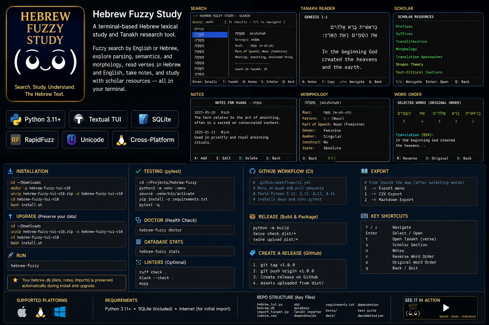

# Hebrew Fuzzy Study v10




## New in v3

### True Tanakh reader
- Select a book and chapter.
- Scroll verse-by-verse.
- Hebrew and English are displayed **side by side** for the highlighted verse.
- Search English text, verse references, or Hebrew text.
- From a dictionary word, press `V` to find verses containing that Hebrew form.

### Verse-linked notes
Every note in the Tanakh reader is attached to the selected verse by database ID.

A verse note stores:
- reference
- Hebrew text
- English text
- tag
- your note
- created timestamp

### Export
Press `E` or click **Export Verse Notes**.

The app exports both:

```text
~/Documents/hebrew-fuzzy-exports/verse-notes-YYYYMMDD-HHMMSS.csv
~/Documents/hebrew-fuzzy-exports/verse-notes-YYYYMMDD-HHMMSS.md
```

The Markdown export includes the Hebrew and English verse beside each note.

## Important: importing the Tanakh

The packaged seed database contains the Strong's dictionary, but **not the full Tanakh**.

After installation run:

```bash
hebrew-fuzzy-import-tanakh
```

Then restart:

```bash
hebrew-fuzzy
```

The Tanakh tab reports the number of verse rows loaded. If it says **Tanakh not imported**, the importer has not completed successfully.

## Upgrade/install

```bash
unzip hebrew-fuzzy-tui-v3.zip
cd hebrew-fuzzy-tui-v3
bash install.sh
```

The v3 installer does **not overwrite an existing working database**, so existing notes are preserved.

## Controls

```text
R       Tanakh reader
V       Find verses containing selected dictionary word
N       Word notes
E       Export all verse-linked notes
Space   Select dictionary word
P       Word permutations
Q       Quit
```


## Scholar tab

v4 adds an offline scholarly reference covering:

- common Biblical Hebrew prefixes
- common suffixes and pronominal suffixes
- transliteration conventions
- roots and verbal stems/binyanim
- formal/source-oriented translation
- dynamic/functional equivalence
- idiomatic translation and paraphrase
- Skopos theory
- text-critical and lexical cautions
- research-source notes

The scholar material deliberately keeps Hebrew source text, morphology, lexical gloss,
English translation, and personal interpretation as separate analytical layers.


## v5 selection/permutation export

- Maximum selection increased from 6 to **10 words**.
- The TUI previews at most **5,000 permutations** to avoid freezing the terminal.
- Selected words export to both CSV and Markdown.
- Permutations export to both CSV and Markdown.
- Up to 8 selected words, the permutation export is complete (8! = 40,320).
- With 9 or 10 selected words, export is capped at the first **100,000** permutations.
  The file explicitly records that it is a capped export and records the total possible count.
- Full 9!/10! generation is intentionally blocked because 9! = 362,880 and
  10! = 3,628,800 rows.

Exports are written to:

```text
~/Documents/hebrew-fuzzy-exports/
```

### Export controls

```text
X          Export selected words
Shift+X    Export permutations
```

The Selected and Permutations tabs also contain export buttons.

## Scholar display fix

The Scholar reference panel now has a flexible height, scroll support, padding, and a visible border.
This fixes the v4 issue where the material could appear blank/collapsed in some terminal sizes.


## v10

- Splash page removed completely.
- App opens directly to the main dictionary/search interface.
- Scholar tab restored and verified.
- Scholar guide includes prefixes, suffixes, transliteration, morphology,
  translation approaches, Skopos theory, text-critical cautions, and sources.
- Scholar content is scrollable with a minimum visible height.
- Press `S` to open Scholar directly.
- Up to 10 words can be selected.
- Word Orders shows only Original Order and Reverse Order.

# Hebrew Fuzzy Study

Hebrew Fuzzy Study is a terminal-based Hebrew lexical research and Tanakh study application built with Python, Textual, SQLite, and RapidFuzz.

It combines fuzzy English-pronunciation search, Hebrew lexical data, bilingual Tanakh reading, scholar-oriented reference material, persistent notes, tags, verse-linked annotations, and structured exports in one local application.

The project is designed for users who want to move quickly between:

- English-style pronunciation
- Hebrew script
- transliteration
- Strong's lexical entries
- definitions and morphology
- Tanakh verse context
- Hebrew and English side-by-side reading
- personal study notes
- translation methodology
- exportable research material

---

## Features

### Fuzzy Hebrew Lexical Search

Search approximately 8,600+ Hebrew and Aramaic lexical entries by English-style pronunciation.

For example:

~~~text
bera
~~~

can surface Hebrew forms whose pronunciation resembles:

~~~text
ber-aw-kaw'
~~~

The search engine uses normalization and fuzzy matching rather than requiring exact transliteration spelling.

Search results can display:

- Strong's ID
- Hebrew form
- pointed Hebrew lemma
- pronunciation
- transliteration
- morphology
- lexical definitions
- dictionary notes

---

## Hebrew and Unicode Normalization

Hebrew Fuzzy Study handles pointed and unpointed Hebrew forms.

For lexical and Tanakh matching, the application can normalize Hebrew by removing combining vowel and cantillation marks where necessary.

This allows a dictionary form such as:

~~~text
ברכה
~~~

to match a pointed Tanakh form such as:

~~~text
בְּרָכָה
~~~

The application keeps the original pointed Hebrew available for reading while using normalized forms for search and matching.

---

## Tanakh Reader

The Tanakh Reader supports bilingual study with Hebrew and English displayed side by side.

Users can:

- choose a Tanakh book
- choose a chapter
- browse verse-by-verse
- read Hebrew and English together
- search English verse text
- search Hebrew text
- search verse references
- jump from a Hebrew dictionary entry to verses containing that form

The Tanakh corpus is not bundled inside the PyPI wheel.

Import it after installation with:

~~~bash
hebrew-fuzzy-import-tanakh
~~~

The importer adds the Tanakh data to the user's local SQLite database.

---

## Tanakh Sources

The importer is designed to retrieve:

### Hebrew

Westminster Leningrad Codex text through the Open Scriptures Hebrew Bible project.

The WLC Hebrew text is public domain.

Open Scriptures-added morphology and lexical annotation data may have separate attribution requirements.

### English

JPS 1917 English Tanakh.

The JPS 1917 translation is public domain.

Source and license information should remain associated with imported data.

---

## Scholar Reference

The Scholar section provides an offline study reference intended to help users interpret lexical and translation information more carefully.

Topics include:

### Hebrew Prefixes

Examples include:

~~~text
ו־    and / but / discourse connector
ב־    in / at / by / with
כ־    as / like / according to
ל־    to / for / toward
מ־    from / out of / than
ה־    definite article in many contexts
ש־    relative element in some forms
~~~

The application cautions against mechanically removing initial Hebrew letters because a letter may belong to the lexical root rather than functioning as a prefix.

### Hebrew Suffixes

The Scholar section explains common:

- pronominal suffixes
- possessive suffixes
- object suffixes
- nominal plural endings
- feminine forms
- verbal person/gender/number endings

Examples include:

~~~text
־י      my / me
־ךָ     your, masculine singular
־וֹ     his / him
־נוּ    our / us
־כֶם    your, masculine plural
־ים     common masculine plural ending
־ות     common feminine plural ending
~~~

---

## Transliteration Guide

The application distinguishes pronunciation aids from scholarly transliteration.

Strong's-style pronunciation may look like:

~~~text
ber-aw-kaw'
~~~

while academic transliteration may preserve more linguistic information.

The Scholar section explains symbols and conventions commonly used for:

- aleph
- ayin
- het
- kaf / khaf
- shin
- sin
- tsade
- qof
- shewa
- long vowels
- stress conventions

The application always prioritizes displaying the Hebrew script alongside transliteration.

---

## Roots and Morphology

Many Biblical Hebrew words are analyzed in relation to consonantal roots.

Example:

~~~text
ברך
B-R-K
~~~

The Scholar section also introduces common verbal stems or binyanim, including:

~~~text
qal
niphal
piel
pual
hiphil
hophal
hithpael
~~~

The application does not assume that a root itself has one fixed English translation.

It keeps separate:

- root
- lexical entry
- surface form
- morphology
- verse context
- English translation

---

## Translation Approaches

Hebrew Fuzzy Study includes a translation-methodology reference so users can distinguish lexical meaning from translator decisions.

### Formal or Source-Oriented Translation

Prioritizes preserving source-language wording and structure where practical.

### Dynamic or Functional Equivalence

Associated especially with Eugene Nida.

Prioritizes communicating the source message naturally to the receiving audience rather than reproducing source-language structure mechanically.

### Idiomatic Translation

Uses normal target-language expressions where direct structural translation would be awkward or misleading.

### Paraphrase

Re-expresses meaning more freely and generally involves a greater amount of interpretation.

### Interlinear or Gloss-Based Study

Aligns source-language forms with compact glosses.

Useful for analysis, but not equivalent to a polished translation.

---

## Skopos Theory

The Scholar section also introduces Skopos theory.

Skopos means purpose.

In translation studies, Skopos theory evaluates translation choices in relation to the purpose, audience, and function of the translation.

Questions include:

- Who is the intended audience?
- Is the translation for scholarship?
- Is it for liturgy?
- Is it for beginners?
- Is it intended for literary reading?
- Should Hebrew structure remain visible?
- Should natural English take priority?

The application treats Skopos theory as distinct from simply calling a translation "literal" or "free."

---

## Text-Critical and Lexical Cautions

Hebrew Fuzzy Study intentionally keeps several analytical layers separate:

~~~text
Hebrew source text
        ↓
morphology
        ↓
lexical possibilities
        ↓
English translation
        ↓
translator methodology
        ↓
user notes and interpretation
~~~

The application does not treat one English translation as though it were automatically the definition of an isolated Hebrew word.

Dictionary glosses represent possible lexical senses.

Context determines which sense may be appropriate in a particular passage.

---

## Notes and Tags

Users can save notes associated with Hebrew lexical entries.

A word note can include:

- tag
- verse reference
- free-form note
- timestamp

Example tags:

~~~text
blessing
prayer
wisdom
verb
name
covenant
translation
grammar
~~~

Notes are stored locally in SQLite.

---

## Verse-Linked Notes

The Tanakh Reader also supports notes attached directly to selected verses.

A verse note stores:

- verse reference
- Hebrew verse
- English verse
- tag
- personal note
- creation time

This allows research notes to remain tied to the exact passage being studied.

---

## Selected Words

Users can select up to 10 dictionary entries.

The Selected Words section can export the selected lexical entries with:

- Strong's ID
- Hebrew
- lemma
- pronunciation
- transliteration
- morphology
- definitions

---

## Word Orders

The application intentionally does not generate factorial permutations.

For safety and usability, selected words produce only:

~~~text
Original Order
Reverse Order
~~~

This avoids generating millions of combinations when many words are selected.

For example, 10 unrestricted words would theoretically have millions of orderings.

Hebrew Fuzzy Study avoids that computational explosion by limiting analysis to the original and reversed sequence.

---

## Export

Exports are written to:

~~~text
~/Documents/hebrew-fuzzy-exports/
~~~

Supported exports include:

- selected words as CSV
- selected words as Markdown
- original/reverse word order as CSV
- original/reverse word order as Markdown
- verse-linked notes as CSV
- verse-linked notes as Markdown

Markdown exports are intended to remain human-readable for study notes, Git repositories, and documentation.

---

## Install from PyPI

Install the current release with:

~~~bash
pip install hebrew-fuzzy-study
~~~

This installs the application and command-line tools.

---

## Included Database

The PyPI package includes the seed Hebrew lexical database.

The packaged wheel contains:

~~~text
hebrew_fuzzy_study/hebrew.db
~~~

On first use, the application copies the seed database into a writable per-user application-data directory.

This prevents the program from attempting to modify data inside Python's read-only or package-managed `site-packages` directory.

---

## Installed Commands

The PyPI package installs three primary commands:

~~~text
hebrew-fuzzy
hebrew-fuzzy-doctor
hebrew-fuzzy-import-tanakh
~~~

### Launch the application

~~~bash
hebrew-fuzzy
~~~

### Check installation health

~~~bash
hebrew-fuzzy-doctor
~~~

### Download and import the Tanakh

~~~bash
hebrew-fuzzy-import-tanakh
~~~

---

## Doctor Command

The doctor command verifies important installation details.

Run:

~~~bash
hebrew-fuzzy-doctor
~~~

It checks items such as:

- Python version
- application database availability
- lexical entry count
- Tanakh verse count
- word-notes table
- verse-notes table

A healthy installation should report the core checks as passing.

---

## Development Installation

Clone the repository:

~~~bash
git clone https://github.com/iamrichmack111/hebrew-fuzzy-study.git
cd hebrew-fuzzy-study
~~~

Create a virtual environment:

~~~bash
python3 -m venv .venv
source .venv/bin/activate
~~~

Install in editable mode:

~~~bash
python -m pip install --upgrade pip
pip install -e .
~~~

Install development tools:

~~~bash
pip install pytest build
~~~

Run the tests:

~~~bash
pytest
~~~

Build the Python package:

~~~bash
python -m build
~~~

---

## Testing

The project uses pytest.

Tests currently cover core behavior including:

- Latin transliteration normalization
- Hebrew vowel-point normalization
- Scholar reference availability
- database existence
- expected lexical record count
- note-table availability

---

## Continuous Integration

GitHub Actions runs the test and build pipeline across multiple supported Python versions.

The CI matrix includes:

~~~text
Python 3.11
Python 3.12
Python 3.13
Python 3.14
~~~

Each CI run performs:

~~~text
checkout
→ Python setup
→ dependency installation
→ pytest
→ package build
~~~

---

## Automated Releases

Tagged releases trigger the GitHub Release workflow.

Example:

~~~bash
git tag -a v1.0.2 -m "Hebrew Fuzzy Study v1.0.2"
git push origin v1.0.2
~~~

The workflow:

~~~text
builds wheel
→ builds source distribution
→ creates GitHub Release
→ uploads artifacts
→ publishes to PyPI
~~~

---

## PyPI Trusted Publishing

PyPI publication uses GitHub Actions Trusted Publishing with OpenID Connect.

No permanent PyPI API token needs to be stored in the repository.

The publishing workflow requests:

~~~yaml
permissions:
  id-token: write
~~~

and publishes through the official PyPI GitHub Action.

---

## Package Contents

The packaged application includes:

~~~text
hebrew_fuzzy_study/
├── __init__.py
├── paths.py
├── hebrew_tui.py
├── import_tanakh.py
├── doctor.py
└── hebrew.db
~~~

---

## Architecture

The application follows a local-first architecture:

~~~text
                Hebrew Fuzzy Study
                       |
        +--------------+--------------+
        |              |              |
   Dictionary      Tanakh Reader    Scholar
        |              |              |
   RapidFuzz       Hebrew/English   Reference
        |              |              |
        +--------------+--------------+
                       |
                     SQLite
                       |
        +--------------+--------------+
        |              |              |
      Notes        Verse Notes      Exports
~~~

---

## Technology Stack

~~~text
Python
Textual
SQLite
RapidFuzz
platformdirs
pytest
setuptools
GitHub Actions
PyPI Trusted Publishing
~~~

---

## Project Goals

Hebrew Fuzzy Study is intended to demonstrate how a specialized humanities dataset can be turned into a structured local software system.

The project combines:

- search engineering
- data ingestion
- Unicode processing
- SQLite data modeling
- terminal UI development
- persistent annotation
- structured export
- Python packaging
- automated testing
- CI/CD
- release engineering
- package distribution

---

## Repository

GitHub:

~~~text
https://github.com/iamrichmack111/hebrew-fuzzy-study
~~~

PyPI package:

~~~text
hebrew-fuzzy-study
~~~

